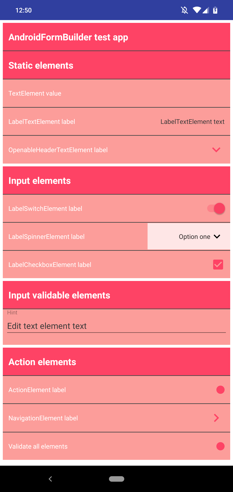

<!-- 
[](https://travis-ci.org/Qase/KotlinLogger)
-->

[](https://jitpack.io/#Qase/AndroidFormBuilder)
[](https://travis-ci.org/Qase/AndroidFormBuilder)
[](https://codebeat.co/projects/github-com-qase-androidformbuilder-master)
[](https://android-arsenal.com/api?level=21)
[](https://opensource.org/licenses/MIT)
[](mailto:balakz@quanti.cz)
[](https://github.com/Qase/AndroidFormBuilder)


## AndroidFormBuilder

Easy to use android form builder. 

## Features
* Very easy to use
* Skinable
* Lot of beautiful color variants
* Easily extendable to new elements
* Built-in input data validating
* Sample [app](github/red.png) is ready to build

## Installation

Click [HERE](https://jitpack.io/#Qase/AndroidFormBuilder).

## Code example

Usage is simple

```kotlin
FormBuilder().
                apply{
                    //static elements
                    addElement(HeaderElement("Static elements"), true)
                    addElement(TextElement("TextElement value"), true)
                    addElement(OpenableHeaderTextElement("OpenableHeaderTextElement label", longerStringValues))
                    addSpace()
                    addElement(HeaderElement("Input elements"), true)
                    addElement(LabelSwitchElement("LabelSwitchElement label", true, showToastCheckboxCallback), true)
                    addSpace()
                    addElement(HeaderElement("Input validable elements"), true)
                    addElement(ActionElement(validateActionCallback, "Validate all elements"))
                    addSpace()
                }
                .buildForm(context, parentView, FormStyleBundle.colorBundleTwo())

```

## Future development
* new layouts
* more color variants
* send your requests



## License
[MIT](https://github.com/nishanths/license/blob/master/LICENSE)
